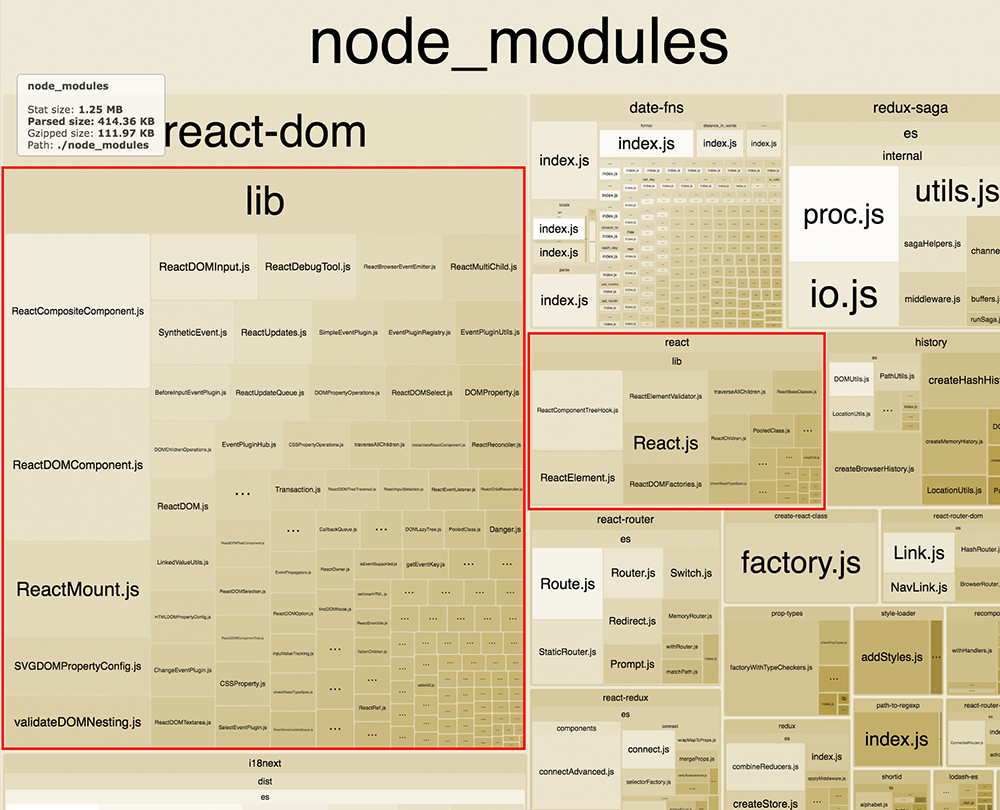
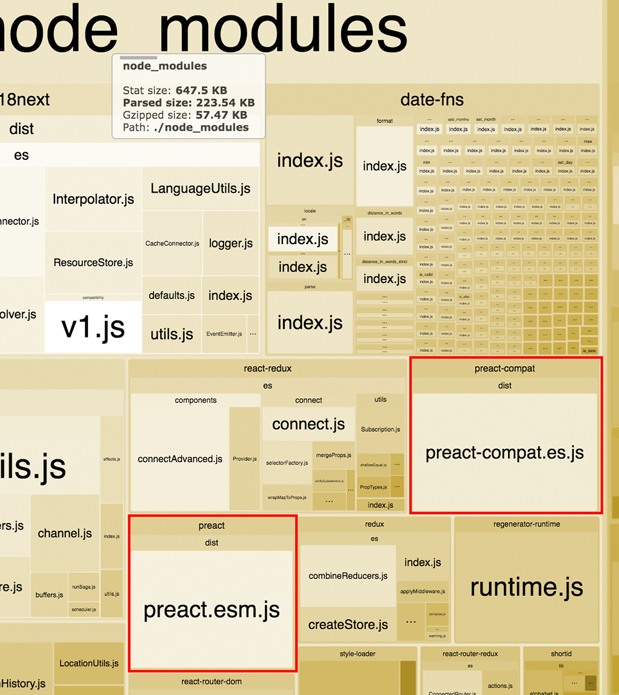

While React is becoming more popular by the day, so are alternatives to the JavaScript framework.

One of these frameworks is [Preact](https://preactjs.com/), which does not aim to do things that
much different, but focuses on performance and size.

This article will take you through the why and how of replacing React with Preact in your existing
project.

<span class="more"></span>

## A bit more about Preact

Preact is the 3kB alternative to React. They strive to provide the same ES6 as React and even
provide an extra layer of compatibility with React, which will make most of the React project work
as intended out of the box!


Even in already existing projects it's possible to start using Preact instead of React. For me this
brought instant performance improvements and my bundle size went down significantly.

## Show me the code!

To switch to using Preact instead of React you only need to install the dependencies and adjust your
WebPack figuration.

First, add Preact to your project:

```
npm install --save preact preact-compat
```

Now adjust your WebPack config to alias `react` to `preact`. In `webpack.config.js` add:

```js
{
  resolve: {
    alias: {
      react: 'preact-compat',
      'react-dom': 'preact-compat',
    },
  },
}
```

There is a more [in dept explanation of switching to Preact](https://preactjs.com/guide/switching-to-preact)
over at Preact's docs. Give it a read if you don't use WebPack for instance.

In order to get _React Dev-Tools_ working nicely with Preact, I suggest you include the following
snippet in your app's entry point. Just before calling `ReactDOM.render` add the following:

```js
if (module.hot) {
  require('preact/devtools');
}
```

This will add `devtools` compatibility when you're running your app in `dev-server` mode by WebPack.
If you `require` the `devtools` outside of the if-clause it will be included in the production
bundle of your app, best avoid that!

And that's all there is too it!

## But, why switch?

There are many possible reasons one would switch from using React, but the one I've been hearing a
lot lately is [React's license](https://code.facebook.com/posts/112130496157735/explaining-react-s-license/).

I can imagine people don't want to be dependent on projects by big software companies like Facebook
or Google. Luckily, [Preact has the MIT license](https://github.com/developit/preact/blob/master/LICENSE).

## Performance and size

While React is super fast on it's own, Preact delivers an even faster experience. In my case I
couldn't really tell much of a difference, but I noticed Preact executed some binding a bit
differently. This made my components mount earlier than in React. Nice.

The biggest difference was in the size of the bundle. Using [`webpack-bundle-analyzer`](https://github.com/th0r/webpack-bundle-analyzer)
I compared the two bundles which were build with WebPack. Both cases used the `--optimize-minimize`
flag to ensure they both got minified in the process.

### Bundle with React


### Bundle with Preact


Look at the difference compared to the other libraries living in the bundle! I was amazing by the
decrease in size I was able to get.

## Compatibility with other libraries and IDEs

The great thing about `preact-compat` is, is that it also provides compatibility with popular
libraries you might already use in your project. For me `react-redux` and `react-router` just worked
after I applied the alias technique I described earlier. You should test your app thoroughly though.

Another thing I really like is how well `eslint` and `flow` work with this approach. They'll still
think you're using React, which certain rules in `eslint` can check for.

When I added Preact as a standalone earlier in the project I couldn't get `eslint` to stop telling
me include React in `JSX` files, but I was using Preact for that. Aliasing solves this.

Another really great win is **compatibility with the IDE** I use most: WebStorm. Same as for `eslint` it
will still consider `import React from 'react';` to be just React, while in truth it's Preact which
get included in your bundle in the end.

## Wrapping up

Hopefully I got you excited to try and apply Preact to your current project. It's not too much work
and you don't actually need to adjust your code base, so that's awesome.

Feel free to reach out if you have any questions!